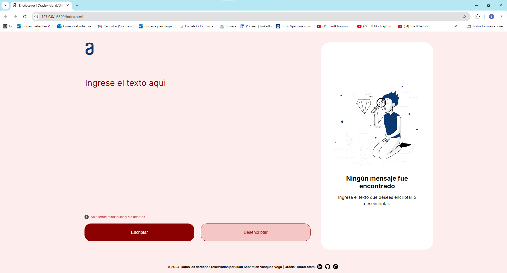

# Text Encryptor

This web application provides a simple interface for encrypting and decrypting text using a custom encryption algorithm. The application is designed to be user-friendly, with an emphasis on ease of use and accessibility. Users can enter text into a textarea and choose to either encrypt or decrypt the input with the click of a button. The application handles only lowercase letters without accents, ensuring smooth processing.

### Features

+ **Text Encryption and Decryption:** Users can easily encrypt or decrypt their input text by clicking the corresponding button.

+ **User Interface**

    + **Responsive Design:** The layout adjusts gracefully to different screen sizes, ensuring usability on both desktop and mobile devices.
    + **Animations:** Subtle animations enhance user experience, including a rotation animation for the logo and slide animations for text input and output areas.

+ **Footer:** A fixed footer contains copyright information and links to social media profiles, staying at the bottom of the page for easy access.

+ **Technology Stack:**

    + **Frontend:** HTML and CSS are used to create a clean and responsive design.
    + **JavaScript:** Handles encryption and decryption logic.

## Getting Started
Download the project from 
[the repository.](https://github.com/Sebasvasquezz/Challenge-Encriptador)

You can also clone the file using the following command.

```
git clone https://github.com/Sebasvasquezz/Challenge-Encriptador.git  
```

Once you have the cloned project in your repository. 

Open the index.html file on your browser:


## Encryption Keys

The requested encryption keys are as follows:

- The letter "**a**" is converted to "**ai**".
- The letter "**e**" is converted to "**enter**".
- The letter "**i**" is converted to "**imes**".
- The letter "**o**" is converted to "**ober**".
- The letter "**u**" is converted to "**ufat**".


## Requirements

- It must work only with lowercase letters.
- Letters with accents or special characters should not be used.
- It should be possible to convert a word to the encrypted version and also convert an encrypted word back to its original version.


    ```
    For example:
    "gato" => "gaitober"
    "gaitober" => "gato"
    ```


- The page must have fields for inserting the text to be encrypted or decrypted, and the user must be able to choose between the two options.
- The result must be displayed on the screen.

### Extras:

- A button that copies the encrypted/decrypted text to the clipboard, having the same functionality as ctrl+C or the "copy" option from application menus.


## Author

* **Juan Sebastian Vasquez Vega**  - [Sebasvasquezz](https://github.com/Sebasvasquezz)

## Date

August 03, 2024

## License

This project is licensed under the GNU License - see the [LICENSE.txt](LICENSE.txt) file for details.
